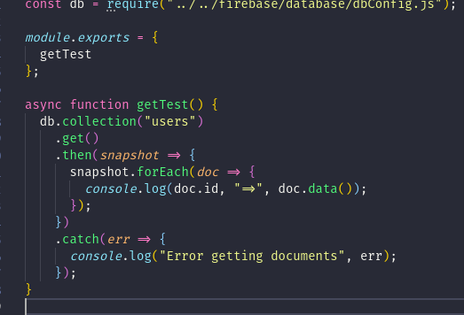
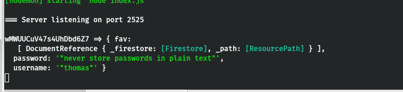

## Project Planning

Our first sprint was focused on coming together as a team and preparing a road map to completion or our Trip Planner app.

### Beginnings...

I contributed to the Technical Design Document, along with my teammates, keeping up a healthy debate about what technologies we should use and why. Google Docs and zoom both were both invaluable in this process. I set up our app on Firebase, and initialized our Cloud Firestore database. Using the provided documents, I managed to get our backend connected to Firebase, albeit, only locally, not on the deployed server. I spent a lot of time with the Firebase docs, learning about how to use the non-SQL database we are using, and about how to link our back-end to Firebase.

### Analysis

One of my main objectives for this sprint has been to connect our database to our back-end server. This has proven to be challenging, especially from a security standpoint. Firebase provides a service account JSON file for authentication betweend our server and theirs. This is reasonably easy to use when working locally, but has proven to be a challenge to figure out how to deploy on heroku without exposing sensitive information on GitHub. I attempted to move the sensetive information into environment variable, but I got parser errors, since the Firebase private key is very long, with several new line escape characters.

As far as accessing data in the database from the server, I have figured out how to console log retrieved data, but not how to send that along as a response from the API.

Results in:

My goal for the weekend is to figure out how to return data retrieved from the DB to the client sending the request to our API. I also want to be able to write data to the DB using API endpoints on our server.

### Milestone Reflections

Our group handled the project analysis and TDD writing very collaboratively. I was the main evangelist for using Firebase, something I hope I don't regret. I spent a lot of time on the Firebase docs, familiarizing myself with the database and authentication services they provide, and managed to make a compelling case to my team about using it. I feel like I haven't made too many concrete contributions to the project yet, which is a little discouraging for me, but I'm trying to press forward and learn what I can to complete the tasks I have taken on.

I also did lots of research for Map API's we could use, mostly on Google Maps API's. We ended up going with MapBox because of the freedom to do more theming, which could help our app stand out from the Material crowd.

Overall, this sprint was a whole lot of research on my part, with little results. I hope that I can turn this around for next Sprint, and provide more meaningful contributions to the team.
