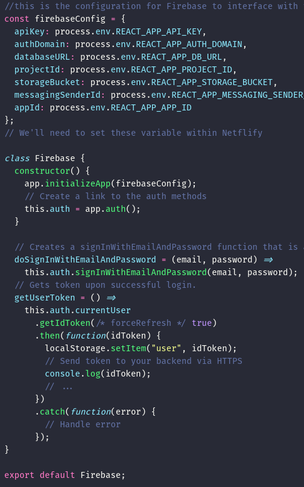
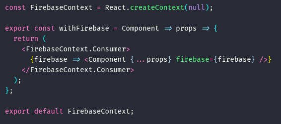
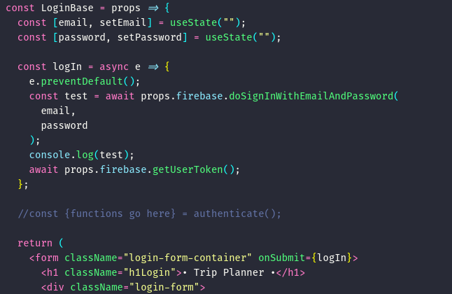
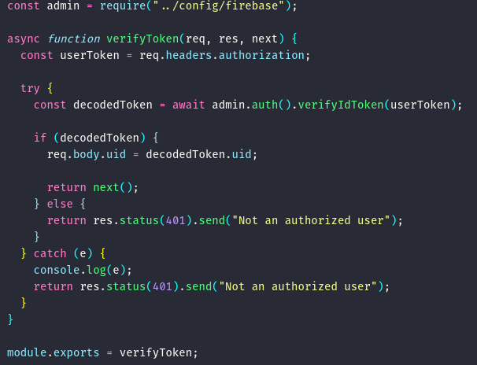

## Working with Other Developers

This sprint was all about learning to work together as a team.

### Individual Accomplishments

This sprint, I was essentially the Firebase point-man for our group. I managed to configure our backend in such a way as to technically work with Firebase, but it was not the _correct_ way. Luckily, I found a [Medium article](https://medium.com/@_josueperalta/using-firebase-auth-with-a-custom-node-js-server-part-1-53bdb622c89a) written by Lambda's own Josue Peralta that helped me figure out how use regex to solve the problem I was having with parsing my Firebase private key from an environment variable. After that was taken care of, it was much easier to get into the nitty-gritty of setting up our authentication and database systems. I spent the rest of the sprint writing database helper functions, and some of the endpoints. I also set up Firebase to work with our front-end for authentication purposes. We now have the ability to obtain a key (with proper credentials, of course) from Firebase, that will work with our authentication middleware on the back-end to secure our server endpoints.

### Detailed Analysis

One of the most difficult things to figure out this sprint was how to set up Firebase in React. [This tutorial](https://www.robinwieruch.de/complete-firebase-authentication-react-tutorial/) was my ticket to success, and taught me a lot about the nuts and bolts of React and Firebase.

Essentially, I had to create an overarching Firebase provider component with which to wrap our app. This ensured that only one instance of Firebase would be running within the app. Then, I had to create a higher order component with which to pass Firebase functionality to individual components within the app.

After applying the HOC to our Login component, our app was able to send credentials to Firebase, retrieve an ID token if the credentials matched, and save that token to local storage.

With that token save in local storage, our React front-end can send it along in an authorization header to be authenticated by our back-end. Our endpoint restriction middleware verifies the token with Firebase, and allows the clients request to get where it needs if the token is valid. This saves the trouble of creating our own JSON web tokens in the back-end, and then still having to verify that with Firebase.

I feel like this was one instance where using Firebase was a major advantage for us, as it saved us the trouble of coming up with an authentication system from scratch. It _should_ also make it easier to add other authentication methods in the future (Google, Facebook, etc.).

### Weekly Reflection

Our team has come together in a very pleasing way. We all kind of naturally fell into roles, with Erin and Melvin focusing on the front-end, Jesse and I focusing on the back-end, and Oliver working on styling and researching our map APIs. Our PM, Modesto, gave us a rundown on how to effectively use Trello, and that went a long way toward keeping us organized, focused, and not stepping on each other's toes and creating more work for ourselves.

Modesto also helped by allowing us to keep our Zoom session open throughout our class times, which gave us all a better sense of comaraderie and immediacy in our communications. Our group has a pretty laid back dynamic, and I feel that we all get along pretty well. As far as my contributions to the team dynamic, I feel like I try to keep things light, but relatively professional. Nobody has come to me with any personal issues (so far!), and I hope that continues to be the case. I do feel like pushing so hard to use Firebase might have caused a little friction in the beginning, as the learning curve slowed progress. I felt like my inability to get work done faster was holding back the team. In the end, I feel like I made up for it some later on in the sprint, and pitched in on the front and back ends to get us up to speed with authentication.

As far as making sure everyone on the team has a voice, I try to avoid making unilateral decisions. If I'm thinking about something that will have a major effect on the project as a whole, I always try to ask for opinions, especially dissenting ones, as those can lead to better choices overall. I'm not afraid to speak my mind, and I try to encourage other to do the same.

Overall, I feel like this sprint went well, and I hope that the next one is even better. I feel that as I become more familiar with the workings of Firebase, the quicker I become at learning and implementing new functionality.
