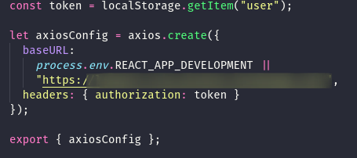

## Understanding Scope

This sprint was all about implementing features and responsive styling.

### Individual Accomplishments

I almost exclusively worked on the features during this sprint. I tied up some loose ends in regards to the database (arrays are no joke in Cloud Firestore), connected the front-end to our authentication services, and laid the groundwork for our front-end and back-end to communicate effectively and securely. I also spent a lot of time working on implementing our map features, which I am still working on.

### Detailed Analysis

One simple, but important feature that I worked on was setting up axios for our project. Instead of using the default instance that you can import from the axios library, I created a file that configures an instance of axios that automatically configures the base server endpoint dynamically, depending on the environment, and includes the authorization token in the request headers, if there is a token present in local storage.



When importing this configured axios instance, we can do a lot less typing when making calls to the back-end. Instead of

```
axios.get(`https://reallylongherokuappurl/trip/${tripId}`)
```

we can type

```
customAxios.get(`/trip/${tripId}`)
```

And all without having to manually grab and send the authorization token with every request. As a bonus, I have it check for an environment variable that can contain the local development back-end url. This makes things easier for us to debug the backend so that it works better with the front-end, while the deployed front-end will communicate with the deployed back-end. Maybe next sprint challenge, I can talk about how I've conquered Google Maps API (fingers-crossed)!

### Reflection

This sprint made me realize that teamwork is very important. I worry some about the cohesiveness of our app, as the members of our group have been effectively siloed off in our specialties, and as those aspects start to interact with each other, difficulties arise. For instance, I was mostly working on the back-end, specifically setting up the authorization and database aspects. This sprint, I began to implement features in the front-end, and was a little lost. In all my time researching Firebase, I spent no time learning about React hooks, which our front-end folks are using to build up the front-end. I'm torn between just doing things the way I know, and spending time I'm not sure I have learning a new way to do things. I don't want to step on anyone's toes with my code, but we also have deadlines to consider.

I'm still overall very happy with my team. Everyone has maintained a friendly and professional demeanor, and I feel like any conflicts have been handled without a surplus of negativity. Here's hoping that holds up through the end of labs.
