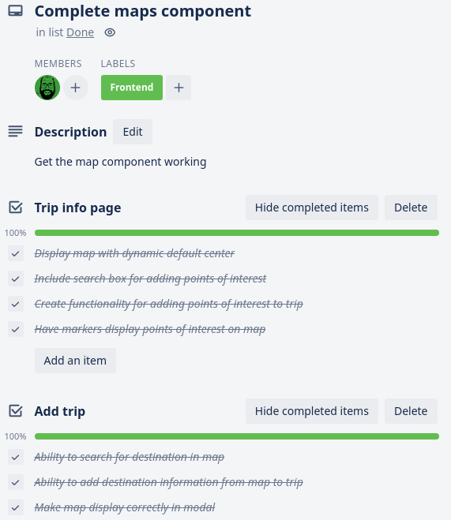

## Presentation

This sprint was all about pulling together the disparate parts of our app into a cohesive whole, and finishing up those key features that weren't finished by the end of last sprint.

### Individual Accomplishments

Over the course of this sprint, I managed to get a lot of features functional for the front-end, as well as revising and improving the resource endpoints on the back-end to better communicate with the client.  Our map component was a feature that still needed to be implemented, and I managed to get it displaying smoothly, as well as allowing it to communicate with other components in the app.  I also managed to get a prototypical UI flow completed.  The front-end client can now log-in, view any trips planned by the logged-in user, click on those trips to view more detailed information about the selected trip, and add new trips from the front-end client.  The user can also use the map component to add destinations to a trip in the new trip modal, and add favorite places on the trip details page.

### Detailed Analysis

The map component was a huge challenge for me, both with this sprint and last.  It needs to do a lot of heavy lifting for our app, and even in its unpolished form, I'm very pleased with what I managed to get done with it.  One big thing I learned was to do plenty of research on component libraries before settling on one.  The Google Maps React library that I chose turned out to maybe not be the most straight-forward.  However, by the time I realized this, I had already sunk several hours into learning how to use it, and decided to keep going with what I had, insteading of starting over from scratch.  In the end, I managed to get it to work out, but I will definitely be spending more time on [npmjs](https://www.npmjs.com), using the tools there to determine the best component library to use.

After poking and prodding at the code provided in the documentation, I figured out how to access place information from Google Maps.  This was the main obstacle for implementing several features, like adding destination and favorite place information to our user's trips.  With this step completed, I could finally do the work needed to allow a user to add a trip from within the front-end client.

In order to do that, I had to be able to get data from several child components that were used by the NewTripModal component in the modal's state.  This meant learning how the date picker worked, and getting place data from the maps component.  After devising functions to do this, I could now post my completed trip object to our server to be saved!

From there, it was relatively easy to get the ReactTable component on the trip list page to display all the trips planned by the user.  After some difficulty caused by some weird Express quirks on the back-end (solved with a lot of help from our TL Modesto), and some modifications to the resource endpoint and database helper function, I was able to display the correct information.  From there, it was a matter of figuring out how to get a click handler to extract the correct information from the table to allow a user to click through to the individual trip's info page.  That took longer than I'd initially thought it would, but that seems to be the running theme throughout this project.  Overall, I wish I had been able to get more done in this Sprint, but I am proud of the work that I have managed to get done.

### Reflection

Overall, it seems as if everyone in our team has picked a lane, and stuck to it.  I've mainly been in the position of adding functionality to our app, and this Sprint and last, I transitioned from focusing on the back-end to mostly working on the front-end.  I've been less concerned with making things look pretty, and more concerned with getting the key features or our app implemented.  There is still a lot of work to do to get it to MVP, but the basic flow is present now.  I feel like our team has gotten a little less communicative as we each get more confident in our roles, and I fear that if we're not careful, that will come back to haunt us in the final stretch.  I still remain optimistic that we will attain MVP by the end of our labs time, though.