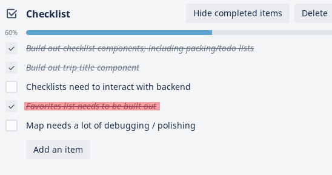
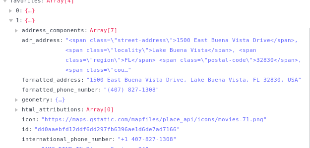

## ~~Polish~~ Crunch

This sprint was supposed to be about polishing up our finished app and getting it ready to "ship".  We are not quite to that step yet.

### Individual Accomplishments

This was probably my least productive sprint.  After things began to be refactored for Redux, I had to go back and refactor some code to work with it.  I also worked on authentication, trying to get the front-end playing more nicely with the back-end.  I also created a nifty little favorites list for the trip info page.

### Detailed Analysis

I got to enjoy making some front-end components this sprint.  The favorite list was the last piece of our trip info page that was missing.  Luckily, I was already pulling that information into the page as an array to use with the map component.  When a favorite is added to a trip, it basically saves the Google Places API output into the Cloud Firestore DB.  This includes a ton of information beyond the longitude and latitude.

I decided that the most pertinent info needed was the name of the place, its address, and a telephone number.  I noticed that the place object included a Google Maps url for each place, so I made the address into a link that, when clicked, will send the user to the Google Maps page.  I also included the telephone numbers as a `tel:` type link for easy use for mobile users to make a call if needed.

I didn't do too much in the way of styling, as I didn't want to get in the way of Melvin and Oliver, who are handling a lot of our styling.  Hopefully, integration into the rest of the page isn't too much trouble.

### Weekly Reflection

The biggest problem I have had, beyond coping with some design changes, is getting everything working correctly on our deployed server.  There are some curious authentication issues that cause initial requests to be rejected.  There is also a problem with our trip list table, wherein it won't refresh after the info it is supposed to be displaying is set into state.  I have yet to determine if this is a problem with the react-table component, or a broader React issue.  It will refresh after a reload, but that's not what we want users doing.  I hope to get some crunch time in this weekend to figure out the table problem, and hopefully get authentication much tighter.